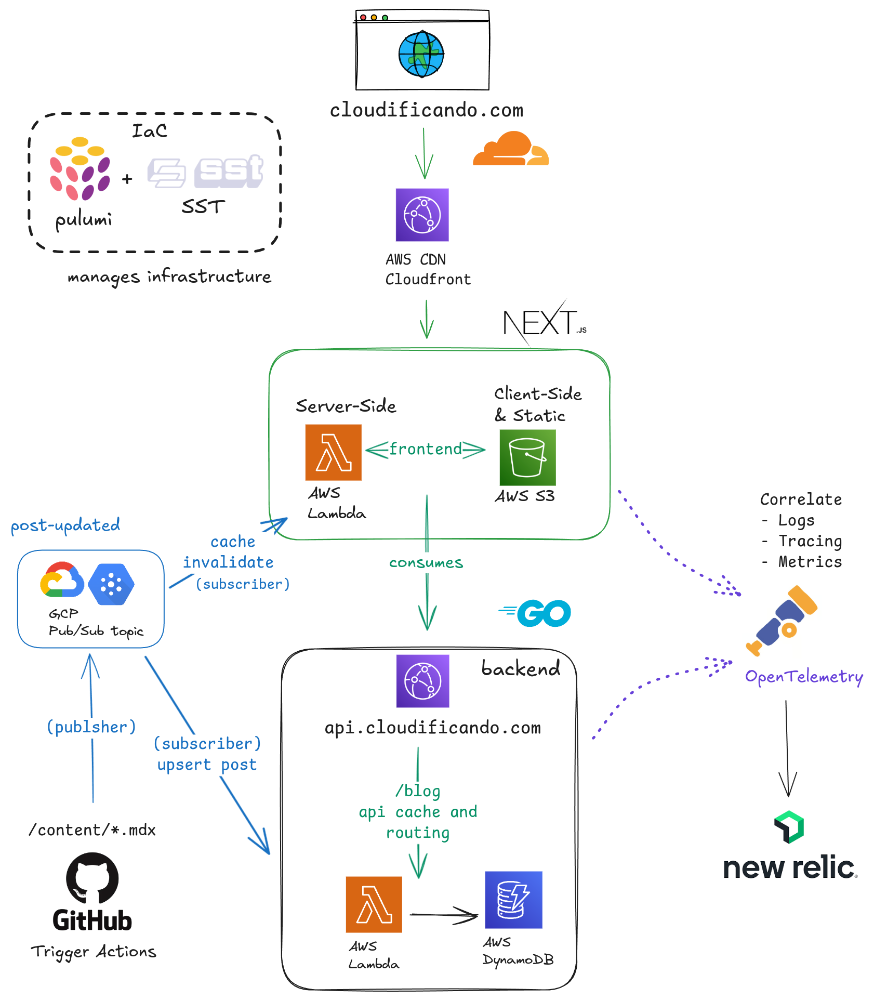

# cloudificando 
## Free-Tier Refference Architecture  

As a **free-tier sommelier**, I designed this architecture to cost **$0.00** for medium throughput. It leverages the following generous free-tier offerings:  
| Service                | Feature                    | Free Tier Limit                         |
|------------------------|----------------------------|-----------------------------------------|
| AWS CloudFront CDN     | Egress/Requests            | 1 TB + 10,000,000 req per month         |
| AWS Egress             | Non-CDN requests           | 100 GB per month                        |
| AWS Lambda             | Function invocations       | 2,000,000 req per month                 |
| AWS DynamoDB           | Database Storage/Req       | 25gb + 40 [W,R]CU (~200M req) per month |
| New Relic              | Data Ingest                | 100 GB ingested data per month          |
| GCP Pub/Sub            | Message Topic              | 20 GB (~20,000,000 messages) per month  |
| GCP Egress             | Data transfer              | 200 GB per month                        |

